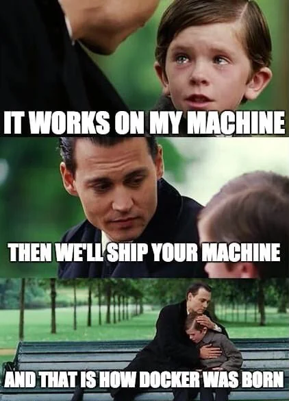

# ROS Workshop
---

<!-- tell windows users to launch wsl every time they open a new window -->

## Prequisites
- Text editor - VScode (not sponsored)
- Terminal emulator - Depends on your OS
- Docker installation


---


# What is docker?
#

<style scoped>
h1 {
    text-align: center;
    position: unset;
    color: white;
}
</style>


<!-- Explain containerization and how it differs from virtualization. -->
---

  - **Containerisation**
    - Think of a container as a lightweight, portable box that contains everything an application needs to run.
    - It includes the application code, runtime, system tools, libraries, and settings.


---



---


# Why docker? 
#
#
- gives you the ability to run a program on any given machine with docker without dependency issues and conflicts
`* additional usecase - scale apps over multiple servers`

---

# How does it work?
#


---

- **Dockerfile**
  - A text file with instructions on how to build a Docker image.
  - It's like a recipe for creating your container environment.
  
- **Docker Image**
  - A snapshot of a container's file system.
  - Built from a Dockerfile.
  - Immutable and can be shared.
  
- **Docker Container**
  - A running instance of a Docker image.
  - Isolated and has its own filesystem, network, and process space.

---

<style scoped>
h2 {
    text-align: center;
    position: unset;
    color: white;
}
</style>


## Basic Docker Commands

---

## Container Management and interaction

  - `docker run`: Create and start a container.
    - Example: `docker run -it --rm f1tenth_gym_ros`
  - `docker ps`: List running containers.
  - `docker exec`: Run commands in a running container.
    - Example: `docker exec -it [container_id/name] bash`

---


<style>
img[alt~="center"] {
  display: block;
  margin: 0 auto;
}
</style>

# Why *TERMINAL?*

\* this is basically the `Avada Kedavra` of TERMINAL world, dont ever use this

<!-- account for differences between different os -->

---
<style scoped>
h2 {
    text-align: center;
    position: unset;
    color: white;
}
</style>

## Basic Terminal Navigation

---

## File Navigation

  - `ls`: List directory contents.
  - `cd`: Change directory.
  `cd /home` - takes you to the home folder
  `cd /` - takes you to the root folder
  - `pwd`: Print working directory path.


---

## File Management

  - `mkdir`: Create new folder.
  `mkdir folder1`
  - `touch`: Create new empty files.
  `touch file1.txt`  
  `touch file2.txt` 
  - `cp`: Copy files or directories.
`cp file1.txt [to_path]` 
`cp -r folder1 [to_path]` 


---

## File Management

  - `mv`: Move or rename files or directories.
  `mv file2.txt file3.txt`
  `mv file1.txt [to_path]`
  `mv folder1 [to_path]`
  - `rm`: Remove files or directories (use with caution). (rm -rf)
`rm file3.txt`                
`rm -r folder1`               
`rm -rf [path_to_folder]`      

<!-- Deletes file1.txt
Recursively deletes folder1 and all its contents
Forcefully deletes a folder and all its contents without prompting (use with caution) -->

---

## Viewing and Editing Files

  - `cat`: Display file contents.
  `cat file1.txt`
  - `nano` or `vim`: Basic text editors within the terminal.
  `nano file1.txt`

---

## Tips and Tricks

  - **Tab Completion**: Quickly complete commands or file names.
  - **Command History**: Use the up/down arrow keys to navigate through previous commands.
  - **Wildcards**: Utilize `*` and `?` for pattern matching.
  `ls *.txt` Lists all files in the current directory that end with .txt
  `ls file?.txt` Lists files that match the pattern file?.txt, ie:file1.txt

---


---


 
# Acessing your container through VS code


---


---


---


---


---

<style scoped>
a {
    text-align: center;
    display: block;
    font-size: .8;
    text-decoration: none;
    margin: 1 auto;
}
</style>
- Explains key concepts (fast!)
[100+ Docker Concepts you Need to Know (youtube.com)](https://www.youtube.com/watch?v=rIrNIzy6U_g)
- CLI Cheat Sheet
[docker_cheatsheet.pdf](https://docs.docker.com/get-started/docker_cheatsheet.pdf)

---
<style scoped>
h2 {
    text-align: center;
    position: unset;
    color: white;
}
</style>

# Introduction to ROS

---

<style scoped>
h3 {
    text-align: center;
    position: unset;
    color: white;
}
</style>

# What is ROS?

### Middleware framework for robot software development

### Facilitates communication (Topics, Services, Actions) between different robot components (Nodes)

---

# Why Use ROS?

-   Modularity and reusability
-   Large, active community
-   A lot of libraries and tools provided

### OPEN SOURCE FTW!!

---

# What are ROS Nodes?

-   Nodes are individual processes that handle specific tasks
-   Example (For camera processing):
    -   Camera node (to get images)
    -   Processing node (to process images)
    -   Output node (uploads the processed images)
-   Can be combined to create a complete robot system

---

# Node Communication

### How do nodes **communicate**?

-   **Topics**
-   **Services**
-   **Actions**

---

# ROS2 Communication: Topics

-   Deploys a Publish-Subscribe Mechanism
-   Used on continuous data streams
-   The topic acts as a notice board for all to see messages.
-   Nodes **publish** messages to topics and other nodes **subscribe** to those topics to receive the messages.

---

<style>
img[alt~="center"] {
  display: block;
  margin: 0 auto;
}
</style>


---

# ROS Messages

-   ROS messages are the data that are communicated via topics.
-   A message has a fixed structure that defines what kind of data it can carry (e.g. `sensor_msgs`, `geometry_msgs`)
-   Data types (vectors, numbers, characters)
-   Holds different types of data together

---
<style scoped>
pre {
   color: ;
}
</style>

## Example: LaserScan Message

-   **`sensor_msgs/LaserScan`** is used to communicate data from a LIDAR sensor.
-   It contains:
    -   **Header**: Timestamp and frame ID
    -   **Angle** and **range** arrays for LIDAR measurements

```
std_msgs/Header header
float32 angle_min
float32 angle_max
float32[] ranges
```

---

## Example: Odom (Odometry) Message

-   **`nav_msgs/Odometry`** is used for representing robot's movement in space.
-   Contains:
    -   **Pose**: Position and orientation.
    -   **Twist**: Velocity information (linear and angular).

```
std_msgs/Header header
geometry_msgs/PoseWithCovariance pose
geometry_msgs/TwistWithCovariance twist
```

---

## Example: Ackermann Steering Message

-   **`ackermann_msgs/AckermannDrive`** is used for controlling vehicle steering.
-   Contains:
    -   **Steering angle**: Angle to turn the wheels.
    -   **Speed**: Forward velocity of the vehicle.

```plaintext
float32 steering_angle
float32 speed
```

---

# ROS Projects

---

# Content

1. [ROS Workspaces](#ros-workspaces)
2. [ROS Packages](#ros-packages)
3. [ROS Launch Files](#ros-launch-files)

---

# ROS Workspaces

### A workspace is a collection of ROS2 packages and nodes for a specific project.

-   It contains important directories:
    -   **`src`**: Source code for packages
    -   **`build`**: Compiled binaries
    -   **`install`**: Development environment setup
-   **colcon build** builds your binaries. It happens when you're creating your workspace
-  **Sourcing** allows access to those binaries **`source ./install/local_setup.bash`**

---

## Python Workspace

```
ros_ws/
├── build/
│   └── ...
├── install/
│   └── ...
├── log/
│   └── ...
└── src/
    └── my_package/
        ├── package.xml
        ├── CMakeLists.txt
        ├── resource/my_package
        ├── setup.cfg
        ├── setup.py
        └── my_package/
            └── node.py
```

---

# ROS Packages

### A ROS package is the basic building block of ROS projects.

It contains:

-   Nodes
-   Message definitions
-   Service and Action definitions
-   Launch files
-   Metadata files (list of dependencies)

**Makes it easier to share code with others**

---

# ROS Launch Files

-   A **launch file** is a script that automates the process of starting multiple nodes and setting configurations in ROS2.
-   Instead of manually starting each node, a launch file can launch them all together.
-   They are written in Python in ROS2 (unlike XML in ROS1).

---

## Why Use Launch Files?

-   Simplifies running multiple nodes, especially in complex systems.
-   Allows for setting parameters, remapping topics, and configuring environments.
-   Great for automating testing and deployment of robots.

---

# Launch File Example

```python
# my_launch_file.py
from launch import LaunchDescription
from launch_ros.actions import Node

def generate_launch_description():
    return LaunchDescription([
        Node(
            package='my_package',
            executable='my_node',
            name='my_node_name',
            output='screen',
        ),
    ])
```
---

# ROS2 Practical

---

# Contents

1. [ROS2 Debugging on Terminal](#1-ros2-debugging-on-terminal)
2. [Creating ROS2 Workspaces](#2-creating-ros2-workspaces)
3. [Creating ROS2 Packages](#3-creating-ros-packages)
4. [Publishing](#4-minimal-publisher)
5. [Subscribing](#5-minimal-subscriber)
6. [Extra](#6-extra)
7. [References](#7-references)

---
# Open the Container
- Windows/ Linux
```
cd ~/F1Tenth_Workshop/install_linux
sudo ./run_docker_container.sh
```
- Mac
```
cd ~/F1Tenth_Workshop/install_macos
sudo ./run_docker_containers_mac.sh
```

---

# 1. ROS2 Debugging on Terminal

-   Useful for quick debugging and sanity checks
-   Viewing Topics
    `ros2 topic list`
-   Publishing Topics
    `ros2 topic pub -r 1 /topic_name std_msgs/String "data: Hello World!"`
-   Viewing messages of a topic
    `ros2 topic echo /topic_name`

---

# 2. Creating ROS2 Workspaces

1. Make a directory for a ros2 workspace

```
mkdir -p /ros2_ws/src
```

2. Change directory to the ros2 workspace

```
cd /ros2_ws
```

3. Build your workspace

```
colcon build
```

---

# 3. Creating ROS Packages

1. Change directory to the source folder

```
cd /ros2_ws/src
```

2. Create a ROS package

```
ros2 pkg create my_package --build-type ament_python --node-name my_node --dependencies rclpy
```

---

# 3. Creating ROS Package (for workshop)

-   To facilitate the workshop, all scripts and packages have already been made

1. Deleted the package created

```
rm -rf /ros2_ws/src/my_package
```

2. Copying the pre-made package

```
cp -r /f1tenth_workshop/ros2_ws/src/my_package /ros2_ws/src
```

---

# 4. Minimal Publisher

1. Writing your first publisher script

-   [minimal_publisher.py](../ros2_ws/src/my_package/my_package/minimal_publisher.py)

---

# 4. Minimal Publisher cont.

2. Adding your script as an executable. Open `setup.py`

```
entry_points = {
    "console_scripts":[
        ...
        minimal_publisher = my_package.minimal_publisher:main
        ...
    ]
}
```

---

# 4. Minimal Publisher cont.

3. Build your package

```
colcon build --packages-select my_package
```

4. Run your node

```
# Sourcing the Overlay
source /ros2_ws/install/local_setup.bash
# Starting the Node
ros2 run my_package minimal_publisher
```

---

# 5. Minimal Subscriber

1. Writing your first subscriber script

-   [minimal_subscriber.py](../ros2_ws/src/my_package/my_package/minimal_subscriber.py)

---

# 5. Subscriber cont.

2. Adding your script as an executable. Open `setup.py`

```
entry_points = {
    "console_scripts":[
        ...
        minimal_subscriber = my_package.minimal_publisher:main
        ...
    ]
}
```

---

# 5. Minimal Subscriber cont.

3. Build your package

```
colcon build --packages-select my_package
```

4. Run your node

-   Running ROS2 Executable

```
# Sourcing the Overlay
source /ros2_ws/install/local_setup.bash
# Starting the Node
ros2 run my_package minimal_subscriber
ros2 topic pub -r 10 my_topic std_msgs/String "data: Hello minimal_subscriber!"
```

---

# 6. Extra

-   [Additional Info](#additional-info)
-   [ROS2 Launch](#ros2-launch)
-   [ROS2 Messages](#ros2-messages)

---

# Additional Info

-   Running as Python script as it is a quick way to tune parameters.

```
python3 minimal_pubsub.py
```

-   Publishing and Subscribing in the same node. [minimal_pubsub](./ros2_ws/src/my_package/my_package/minimal_pubsub.py)

```
ros2 run my_package minimal_pubsub

```

-   Developing ROS2 packages in C++ `ros2 pkg create cpp_package --build-type ament_cmake`

---

# ROS2 Launch

1. Initialise a ros2 package

```
ros2 pkg create my_bringup --dependencies ros2launch
```

2. Define your launch file [my_bringup.py](../ros2_ws/src/my_bringup/launch/my_demo.launch.py)
3. Add launch file to `setup.py`

```
import os
from glob import glob
...
(os.path.join('share', package_name, 'launch'), glob(os.path.join('launch', '*launch.[pxy][yma]*')))
...
```

---

# ROS2 Messages

-   Rarely, altough sometimes, you'll need to create your own ROS messages.
-   Steps:

1. Initialise a ros2 package `ros2 pkg create my_msgs --dependencies std_msgs geometry_msgs`
2. Edit the `CMakeList`:

```
find_package(rosidl_default_generators REQUIRED)

rosidl_generate_interfaces(${PROJECT_NAME}
	"msgs/MyMessage.msg"
)

ament_export_dependencies(rosidl_default_runtime)

```

---

# ROS2 Messages cont.

3. Edit the `package.xml`

```
  <buildtool_depend>rosidl_default_generators</buildtool_depend>
  <exec_depend>rosidl_default_runtime</exec_depend>
  <member_of_group>rosidl_interface_packages</member_of_group>

```

---

# ROS2 Messages cont.

4. Create your message file:

```
cd /ros2_ws/src/
mkdir msgs
cd msgs
touch my_msg.msg
```

---

# ROS2 Messages cont.

5. Define your message file.

-   This uses other ROS2 messages e.g. std_msgs, geometry_msgs
-   [my_msg.msg](./ros2_ws/src/my_msgs/msgs/MyMessage.msg)

---

# ROS2 Messages cont.

6. Build, Source and Run

```
colcon build --packages-select my_msgs
source /ros2_ws/install/local_setup.bash
ros2 topic pub -r 1 some_topic my_msgs/my_msg "{name: "Lawrence", some_integer: 10, some_vector: [1, 2]}"
ros2 topic echo some_topic
```

---

# 7. References

-   [Creating a Workspace](https://docs.ros.org/en/foxy/Tutorials/Beginner-Client-Libraries/Creating-A-Workspace/Creating-A-Workspace.html)
-   [Creating a Package](https://docs.ros.org/en/foxy/Tutorials/Beginner-Client-Libraries/Creating-Your-First-ROS2-Package.html)
-   [Simple Pusblisher/ Subscriber (Python)](https://docs.ros.org/en/foxy/Tutorials/Beginner-Client-Libraries/Writing-A-Simple-Py-Publisher-And-Subscriber.html)
-   [Create Custom Message](https://roboticsbackend.com/ros2-create-custom-message/#Using_existing_messagesinterfaces)
-   [Create a Launch File](https://docs.ros.org/en/foxy/Tutorials/Intermediate/Launch/Creating-Launch-Files.html)

---

# F1Tenth Simulator

---

## Launch The Simulator

Open a terminal in the docker container
```sh
source /opt/ros/foxy/setup.bash
source ./install/local_setup.bash
ros2 launch f1tenth_gym_ros gym_launch.py
```

---

## F1Tenth Topics

Open a new terminal in the container
```sh
ros2 topic list
```
Topics related to the car
```
/drive              # Drive command via AckermannDriveStamped messages
/ego_racecar/odom   # Odometry of the car
/scan               # Lidar Scans
/cmd_vel            
```
<!-- ros2 topic pub /drive {...}
ros2 topic echo /laser -->
---

## Publishing a Drive Command

`ros2 topic pub -r <Hz> <topic_name> <msg_type> <msg_atributes?>`

`ros2 topic pub -r 1 /drive ackermann_msgs/msg/AckermannDriveStamped "drive: {'speed': 1.0, 'steering_angle': 0.5}"`

---

## Echoing Odom

```sh
ros2 topic echo ego_racecar/odom --no-arr
```
> NOTE: The `--no-arr` argument is to prevent displaying large covariance arrays

---
## Driving The Car Via Teleoperation

Keyboard Teleoperation
```sh
ros2 run teleop_twist_keyboard teleop_twist_keyboard
```
---

## Changing The Map

- Stop the simulator from running using `CTRL+C`
- Navigate to `/sim_ws/src/f1tenth_gym_ros/config` and edit the `sim.yaml` file
    ```yaml
        # map parameters
        map_path: '/sim_ws/src/f1tenth_gym_ros/maps/Spielberg_map'
        map_img_ext: '.png'
    ```

- Rebuild the workspace
    ```sh
    colcon build
    source install/local_setup.bash
    ```
---

# Driving The Car Autonomously

Local Planner  (Gap Finder)
```sh
cd /f1tenth_workshop/f1tenth_simulator
python3 gap_finder_base.py
```

