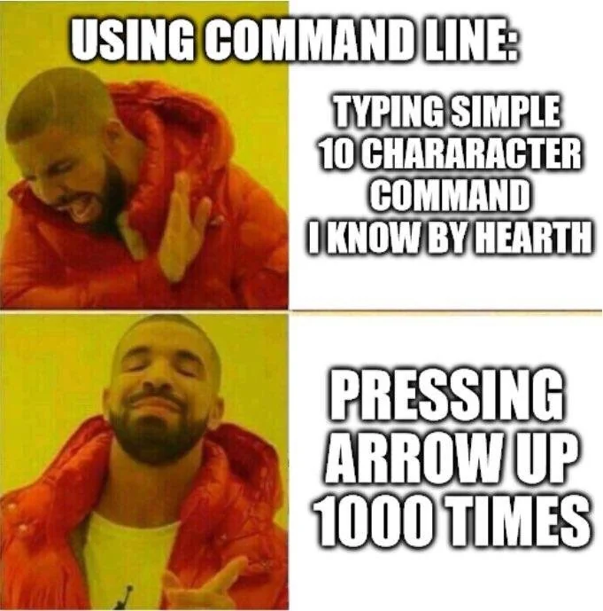
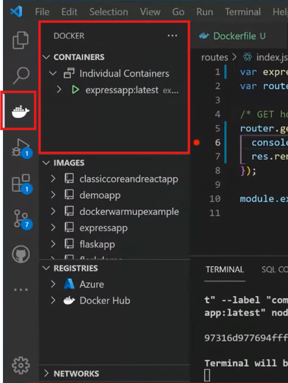

# ROS Workshop
---

<!-- tell windows users to launch wsl every time they open a new window -->

## Prequisites
- Text editor - VScode (not sponsored)
- Terminal emulator - Depends on your OS
- Docker installation

---

# Why *TERMINAL?*

\* this is basically the `Avada Kedavra` of TERMINAL world, dont ever uses this

<!-- account for differences between different os -->

---
<style scoped>
h2 {
    text-align: center;
    position: unset;
    color: white;
}
</style>

## Basic Terminal Navigation

---

## File Navigation

  - `ls`: List directory contents.
  - `cd`: Change directory.
  - `pwd`: Print working directory path.

---

## File Management

  - `mkdir`: Create new directories.
  - `touch`: Create new empty files.
  - `cp`: Copy files or directories.
  - `mv`: Move or rename files or directories.
  - `rm`: Remove files or directories (use with caution).

---

## Viewing and Editing Files

  - `cat`: Display file contents.
  - `nano` or `vim`: Basic text editors within the terminal.

---

## Tips and Tricks

  - **Tab Completion**: Quickly complete commands or file names.
  - **Command History**: Use the up/down arrow keys to navigate through previous commands.
  - **Wildcards**: Utilize `*` and `?` for pattern matching.

---



---


# What is docker?
#

<style scoped>
h1 {
    text-align: center;
    position: unset;
    color: white;
}
</style>


<!-- Explain containerization and how it differs from virtualization. -->

---


  - **Containerisation**
    - Think of a container as a lightweight, portable box that contains everything an application needs to run.
    - It includes the application code, runtime, system tools, libraries, and settings.


---


---


# Why docker? 
#
#
- gives you the ability to run a program on any given machine with docker without dependency issues and conflicts
`* additional usecase - scale apps over multiple server`
<!-- Benefits of Docker

Consistency across environments.
Simplified deployment.
Resource efficiency. -->

---
# Docker for robotics ??

<!-- 
Why Use Docker for ROS and f1tenth?
Simplifies the setup of complex environments.
Ensures everyone is using the same configurations.
Use Cases
Running simulations.
Testing algorithms in isolated environments. -->

---

# How does it work?
#


---

- **Dockerfile**
  - A text file with instructions on how to build a Docker image.
  - It's like a recipe for creating your container environment.
  
- **Docker Image**
  - A snapshot of a container's file system.
  - Built from a Dockerfile.
  - Immutable and can be shared.
  
- **Docker Container**
  - A running instance of a Docker image.
  - Isolated and has its own filesystem, network, and process space.

---

# Acessing your container through VS code

---
<style scoped>
h2 {
    text-align: center;
    position: unset;
    color: white;
}
</style>


## Basic Docker Commands

---

## Image Management

  - `docker pull`: Download images from a registry.
  - `docker images`: List downloaded images.

---

## Container Management

  - `docker run`: Create and start a container.
    - Example: `docker run -it ubuntu:latest /bin/bash`
  - `docker ps`: List running containers.
  - `docker stop`: Stop a running container.
  - `docker rm`: Remove stopped containers.

---

## Interacting with Containers

  - `docker exec`: Run commands in a running container.
    - Example: `docker exec -it [container_id] /bin/bash`
  - `docker cp`: Copy files between host and container.
    - Example: `docker cp [container_id]:/path/to/file /host/path`

---


```bash
#!/bin/sh

container_name=f1tenth_gym_ros
create_container (){
    docker run --rm -it\
    --name ${container_name} \
    -h ${container_name} \
    --env="DISPLAY" \
    --env="QT_X11_NO_MITSHM=1" \
    --volume="/tmp/.X11-unix:/tmp/.X11-unix:rw" \
    -v $(pwd)/sim_ws:/sim_ws \
    f1tenth:gym_ros_foxy \
    run_sim.sh
}

rm_container (){
	if [ "$(docker ps -aq -f name=${container_name})" ]
        then
		if [ "$(docker ps -aq -f status=running -f name=${container_name})" ]
		then
			docker stop ${container_name}
		fi
        	docker rm ${container_name}
        fi
}

if [ "$(docker ps -aq -f status=running -f name=${container_name})" ]
then
	echo "Container is Running. Starting new session."
	docker exec -it ${container_name} bash 
else
	rm_container 
	xhost + local:host
	create_container 
	xhost - local:host
fi
```
---
 ```docker
FROM ros:foxy # Defines which base image youll use

SHELL ["/bin/bash", "-c"]

# dependencies
RUN apt-get update --fix-missing && \
    apt-get install -y git \
                       neovim \
                       python3-pip \
                       libeigen3-dev \
                       tmux \
		       ros-foxy-rviz2

RUN apt-get -y dist-upgrade
RUN pip3 install transforms3d

# f1tenth gym (downloads the code for f1tenth gym)
RUN git clone https://github.com/f1tenth/f1tenth_gym
RUN cd f1tenth_gym && \
    pip3 install -e .

# ros2 gym bridge (downloads the code ros2 gym bridge)
RUN mkdir -p sim_ws/src/
RUN cd sim_ws/src && \
	git clone https://github.com/f1tenth/f1tenth_gym_ros.git
RUN source /opt/ros/foxy/setup.bash && \
    cd sim_ws &&\
    apt-get update --fix-missing && \
    rosdep install -i --from-path src --rosdistro foxy -y && \
    colcon build

RUN printf \	
"\n \
source /opt/ros/foxy/setup.bash \n \
source /sim_ws/install/setup.bash \n " \
>> /root/.bashrc

RUN touch run_sim.sh
RUN chmod +x run_sim.sh
RUN printf \	
"#!/bin/bash \n \
source /opt/ros/foxy/setup.bash \n \
source /sim_ws/install/setup.bash \n \
cd /sim_ws && colcon build \n \
ros2 launch f1tenth_gym_ros gym_bridge_launch.py" \
>> run_sim.sh

#change map
RUN cd /sim_ws && \
sed -i 's/levine/Spielberg_map/g' /sim_ws/src/f1tenth_gym_ros/config/sim.yaml && \
colcon build # ros specific command, youll learn it later

ENTRYPOINT ["/bin/bash"]

#docker build -f f1tenth_gym_ros.Dockerfile -t f1tenth:gym_ros_foxy .

 ```
---

<style scoped>
a {
    text-align: center;
    display: block;
    font-size: .8;
    text-decoration: none;
    margin: 1 auto;
}
</style>
- Explains key concepts (fast!)
[100+ Docker Concepts you Need to Know (youtube.com)](https://www.youtube.com/watch?v=rIrNIzy6U_g)
- CLI Cheat Sheet
[docker_cheatsheet.pdf](https://docs.docker.com/get-started/docker_cheatsheet.pdf)

---


---




---


---


