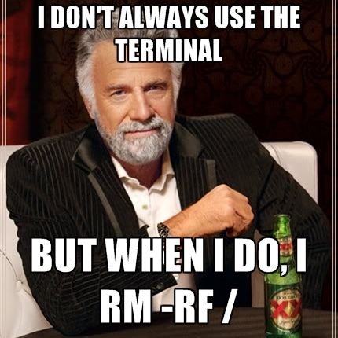
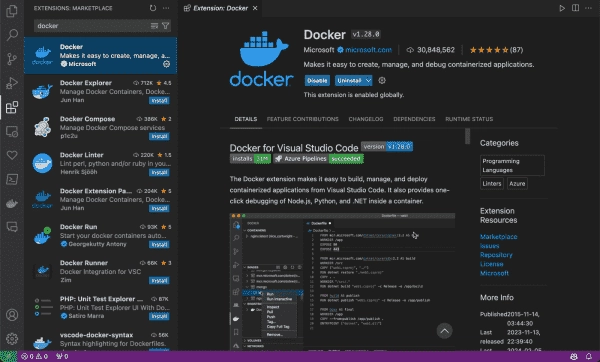
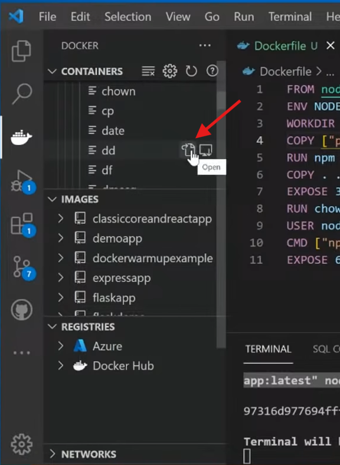

# ROS Workshop
---

<!-- tell windows users to launch wsl every time they open a new window -->

## Prequisites
- Text editor - VScode (not sponsored)
- Terminal emulator - Depends on your OS
- Docker installation

---

# What is docker?
#

<!-- Explain containerization and how it differs from virtualization. -->
---

  - **Containerisation**
    - Think of a container as a lightweight, portable box that contains everything an application needs to run.
    - It includes the application code, runtime, system tools, libraries, and settings.

---

---

# Why docker? 
#
#
- gives you the ability to run a program on any given machine with docker without dependency issues and conflicts
`* additional usecase - scale apps over multiple server`
<!-- Benefits of Docker

Consistency across environments.
Simplified deployment.
Resource efficiency. -->

---

# How does it work?
#

---

- **Dockerfile**
  - A text file with instructions on how to build a Docker image.
  - It's like a recipe for creating your container environment.
  
- **Docker Image**
  - A snapshot of a container's file system.
  - Built from a Dockerfile.
  - Immutable and can be shared.
  
- **Docker Container**
  - A running instance of a Docker image.
  - Isolated and has its own filesystem, network, and process space.
<!-- add in the explanation with the analogy -->
---

## Basic Docker Commands

---

## Container Management and interaction

  - `docker run`: Create and start a container.
    - Example: `docker run -it --rm f1tenth_gym_ros`
  - `docker ps`: List running containers.
  - `docker exec`: Run commands in a running container.
    - Example: `docker exec -it [container_id] bash`

---

# Why *TERMINAL?*

\* this is basically the `Avada Kedavra` of TERMINAL world, dont ever uses this

<!-- account for differences between different os -->

---

## Basic Terminal Navigation

---

## File Navigation

  - `ls`: List directory contents.
  - `cd`: Change directory.
  `cd /home` - takes you to the home folder
  `cd /` - takes you to the root folder
  - `pwd`: Print working directory path.

---

## File Management

  - `mkdir`: Create new folder.
  `mkdir test_folder`
  - `touch`: Create new empty files.
  - `cp`: Copy files or directories.
  - `mv`: Move or rename files or directories.
  - `rm`: Remove files or directories (use with caution). (rm -rf)

---

## Viewing and Editing Files

  - `cat`: Display file contents.
  - `nano` or `vim`: Basic text editors within the terminal.

---

## Tips and Tricks

  - **Tab Completion**: Quickly complete commands or file names.
  - **Command History**: Use the up/down arrow keys to navigate through previous commands.
  - **Wildcards**: Utilize `*` and `?` for pattern matching.

---

---

 
# Acessing your container through VS code

---

- Explains key concepts (fast!)
[100+ Docker Concepts you Need to Know (youtube.com)](https://www.youtube.com/watch?v=rIrNIzy6U_g)
- CLI Cheat Sheet
[docker_cheatsheet.pdf](https://docs.docker.com/get-started/docker_cheatsheet.pdf)

---

---

---

---

